# APFS, Device Tree, IOService, and EFI path construction

[Home](../README.md) · [EFI converter details](nvram-efi-paths.md) · [Branch table](../tables/efi-converter-branches.csv)

The Stage 6F.7 kernel trace distinguishes two ways of producing EFI device paths. A typed XML array supplies named element dictionaries, while an `IOMatch` dictionary can resolve an `IOService` and build a path from registry relationships. Neither route by itself reads or writes firmware. The [22-branch converter register](../tables/efi-converter-branches.csv) records fields, widths, emitted node types, and error paths for the named typed-array elements.

The registry builder in matching `AppleACPIPlatform` was branch-mapped over `0xffffff80014890b2..0xffffff800148ae65`, covering platform/short-form context, ACPI, PCI, USB, media and APFS physical re-anchoring, partition metadata, geometry, and optional file/end nodes. Its previously byte-checked 1,996-record method is **still partial** at the semantic level. The `getUSBDeviceRootPortNumber` helper has 137 original-byte-checked instructions: it tests registry `idVendor`/`idProduct`, reads a parent port byte, subtracts one, and otherwise returns `-1`. Malformed port-data reachability remains unknown; this is not a USB transfer trace.

Eleven selected AppleACPIPlatform transport/MBR helpers account for 1,820 original-byte-checked instructions. Ten transport classes were mapped, and the relevant `IOMedia` vtable targets were independently linked. An MBR fallback reads block zero; a nonzero synchronous read status can flow to success with a caller-zeroed signature in the selected helper. A [same-build hibernation caller](nvram-efi-paths.md#a-hibernation-consumer-of-the-registry-derived-path) now establishes one static consumer of the registry builder and a conditional `boot-image` NVRAM handoff. It does not establish use of that caller's MBR fallback, a failed read, or firmware acceptance. [FW-020](../findings/fw.md#fw-020) retains the bounds and unresolved inputs.

[Editable Mermaid source](../diagrams/efi-path-construction.mmd).

APFS sealing is a different workflow. The [ramrod page](ramdisk-ramrod.md) follows selected root-hash validation and `apfs_sealvolume` calls; the [SSV page](sealed-system-volume.md) states what remains unresolved about snapshots, boot policy, and installed-system verification.
