# Installation and restore architecture

[Home](../README.md) · [Documentation](index.md) · [Evidence](../evidence/README.md)

The audited staging tree is a subset of an Apple update, not a complete installed-system image. The [exact Apple comparison](artifact-provenance.md) establishes byte identity for corresponding retained objects; it does not establish that every component was used. The [image inventory](inventory-images.md) explains the RAMDisk, BaseSystems, Preboot, diagnostics, and cryptex reconstruction.

[Editable Mermaid source](../diagrams/installation-flow.mmd).

Solid edges represent observed packaging or selected static call relationships. Dashed edges mark unproven historical or hardware transitions. In particular, the `Update.plist` writer and reader were traced, but no historical instance of that file was supplied. See [ramrod](ramdisk-ramrod.md), [brain and commands](installer-workflow.md), [firmware handoff](firmware-flashers.md), and [Stage 6F.7](nvram-efi-paths.md).

The trust path has several distinct layers: package/reference identity, code-signature integrity, Image4/certificate checks, trust-cache membership, boot policy, runtime caller authorization, and device firmware acceptance. Passing one layer does not imply the later layers. [Secure Boot](secure-boot.md), [signatures/KCs](code-signing-kernel.md), and [methodology](methodology.md) set out the measured boundaries.

The source for this diagram is [`installation-flow.mmd`](../diagrams/installation-flow.mmd). The [coverage register](coverage.md) shows which of these edges are bounded and which remain pending.
