# Evidence standards and methodology

[Home](../README.md) · [Documentation](index.md) · [Findings](findings-index.md) · [Status](audit-status.md)

> This page is a build-25G83 research snapshot. Static code paths and declared capabilities do not establish execution or effective runtime policy. Original raw evidence is retained privately; public tables and measurements are linked where available.

The [editable diagram](../diagrams/evidence-ladder.mmd) marks the transition from measured bytes and static relationships to runtime or device-side behavior as an evidence gap, not an inference that those events occurred.

## Scope and evidence standards

### What was examined

- The original `macOS Install Data` staging tree and a readable working copy.
- The Intel Software Update RAMDisk and AppleDiagnostics image.
- Reconstructed ARM and Intel BaseSystem images, Intel Preboot, and the Intel system cryptex.
- The exact Apple full installer and its embedded update archive.
- The same-build update-brain archive contained in the official reference.
- Selected firmware, ticket, trust-cache, executable, launch, USB and filesystem metadata.

The collection is **not** a physical image of the installed system, a readback of hardware firmware, or a capture of a running restore session.

### How claims are classified

| Claim class | Example | What it does not establish |
| --- | --- | --- |
| Byte identity | A retained image matches the official image | That its code is vulnerability-free |
| Structural consistency | Container lengths and regions parse correctly | Cryptographic authenticity |
| Signature integrity | Signed bytes verify with a specified key | Every device-policy requirement |
| Configuration | A launch plist declares a socket | An active listener or network reachability |
| Static capability | Instructions can spawn a sealing utility | Historical execution |
| Runtime evidence | Logs or captures corroborate an event | Not collected for the principal behavior claims here |
| Unresolved | A field or path is not fully traced | Evidence of compromise |

Originals were read, not installed, booted, flashed, personalized, repaired or permission-modified. Images were attached read-only. Analysis derivatives were written separately. Read access may affect access-time metadata: this was a live logical examination, not a write-blocked physical acquisition. Working-copy metadata is not substituted for original ownership, timestamps or ACL evidence.

