# Stage 6F.7: NVRAM, EFI paths, sandbox, and helpers

[Home](../README.md) · [Documentation](index.md) · [Findings](findings-index.md) · [Status](audit-status.md)

> This page is a build-25G83 research snapshot. Static code paths and declared capabilities do not establish execution or effective runtime policy. Original raw evidence is retained privately; public tables and measurements are linked where available.

For the current policy boundary, see [sandbox](sandbox-policy.md), [AMFI and entitlements](amfi-entitlements.md), and the [exact next trace](audit-status.md#exact-next-investigative-action). Commands below that invoke `analysis/tools` require the separate private audit workspace and are retained as provenance; this repository does not contain those scripts or the Apple binaries they read.

<a id="kernel-nvram-conversion-and-firmware-helper-selection"></a>
## Kernel NVRAM conversion and firmware helper selection

**Stage 6F.7 is active and incomplete.** Findings **FW-016–FW-021** extend the preceding userspace/EFI trace into matching Intel kernel code. The completed work below is a bounded static analysis, not closure of every helper, parser branch, firmware backend or access-control layer. The last finalized bounded stage remains 6F.6.

<a id="provenance-and-method"></a>
### Provenance and method

The reconstructed Intel BaseSystem, previously matched byte-for-byte to the corresponding official image, supplied `System/Library/KernelCollections/BootKernelExtensions.kc` and all eight inventoried resources beneath `AppleEFIRuntime.kext`. A fresh read-only attachment was checked, nine files were copied and compared with saved inventory hashes, and the attachment was detached. The **67,584,000-byte x86_64 kernel collection** has SHA-256:

`c80161fa3065883753fc285339281361a8469cbb6fb27653c88e2a22eb4807a4`

Its fileset has **204 embedded Mach-O entries**. Only selected methods in `AppleEFINVRAM`, `AppleEFIRuntime`, `AppleACPIPlatform` and two kernel EFI-call routines are examined here; indexing the other entries does not audit their behavior. Original symbol tables identify functions and data. Decoder-only derivatives copy each selected embedded header to offset zero while preserving the original segment mappings. They are not runnable, independently signed kext extractions. Every retained decoded range is compared against the original collection bytes.

The retained analyses contain 2,405 decoded records across 13 NVRAM methods, 3,021 across nine provider/kernel methods, and 177 launcher records, including a recheck of previously examined discovery code. These are symbol/range-delimited records and include alignment padding; they are not counts of reachable instructions. Chained pointers use different bases for chain locations and level-zero targets. The decoder checks 505 NVRAM rebases, corroborates five imports against kernel symbols, and separately proves nine provider type/virtual-method links through the original fixup chains. Treating the stored encoded words as ordinary addresses would misidentify these objects.

The two driver bundles declare version **2.1**, compatible version 2.0, and `OSBundleRequired=Root`. Their matching declarations describe:

`AppleACPIPlatformExpert` → `AppleEFIRuntime` → `AppleEFINVRAM`

The runtime driver requires the `ACPI` resource; the NVRAM driver requires `efi-runtime`. Here, `Root` is a boot-loading classification, not an assertion about a userspace caller's UID. The `Info.plist` files describe loading, dependencies and build metadata; `version.plist` records build/project versions; localized strings provide display/copyright text. Each `CodeResources` file contains a nested `_kasan` executable requirement anchored to Apple, although those standalone executable paths are absent from this inventoried bundle tree. This is a resource-envelope reference, not proof that a KASAN kernel was running. The enclosing image's official-byte match is the provenance evidence. Whole-bundle verification and every embedded signature/trust relationship are not established by these resource files. Ordinary `codesign` previously rejected the outer KC as unsigned; that result is not a kernel-collection boot-policy verdict.

<a id="nvram-authorization-in-the-matching-driver"></a>
### NVRAM authorization in the matching driver

**FW-016 — Observed static checks.** `AppleEFINVRAM::setProperties` accepts a dictionary, iterates its entries, rejects attempts to set `IOUserClientClass`, and dispatches ordinary entries to the three-argument `setProperty` with its Boolean override argument **false**. The two-argument wrapper also supplies false. In the traced implementation, true would skip rejection on the ordinary permission result; these two public-facing routes do not supply it.

`verifyPermission` at `0xffffff800195f221` first consults nine variable-prefix/GUID/operation rules, then a legacy name table. The entitlement check calls `IOUserClient::copyClientEntitlement` for `current_task()` and compares the result with **`kOSBooleanTrue`**. Merely declaring a false value is insufficient. The named rules cover Wi-Fi credential-related variable prefixes and Find My-related prefixes; these are compiled policy names, not credentials or actual NVRAM values collected from this Mac.

For a matching operation-specific rule, a missing required entitlement denies access before the ordinary root/legacy alternatives. Otherwise, the selected logic distinguishes read operations from writes, checks `clientHasPrivilege(..., "root")`, and considers `com.apple.private.iokit.nvram-read-access` or `com.apple.private.iokit.nvram-write-access`. The legacy table supplies per-name exceptions; its terminator supplies the default rule. There are 51 named entries plus that terminator. The user-write classification includes `boot-image`, `ldm` and `testUserWrite`; a separate `testKernelOnly` entry requires the kernel task. Compiled test-name entries do not show those variables exist or have been used.

The `efi-apple-payload…` names do not receive that legacy user-write exception. An ordinary, non-root process without the applicable entitlement therefore fails the traced write check for the firmware payload path. This is a conclusion about this driver branch, not proof that every NVRAM interface has identical policy.

After the ordinary permission check, the **BootPolicyLocalPolicyStorage GUID** receives another explicit requirement: **`com.apple.private.security.bootpolicy.nvram`**. Root alone does not satisfy this extra entitlement check. It is distinct from the `com.apple.private.security.bootpolicy` entitlement observed in `bless`. This Intel driver branch does not establish the complete Apple Silicon LocalPolicy or SEP authorization chain.

SIP, sandbox/MAC hooks, AMFI entitlement authenticity, the initiating launcher's identity, and firmware-side acceptance remain separate boundaries. No ordinary-user invocation test, IOKit write, NVRAM modification, boot-policy change or firmware call was performed.

<a id="xml-to-binary-efi-paths-and-persistent-variables"></a>
### XML to binary EFI paths and persistent variables

**FW-017 — Observed selected conversion chain.** The earlier `bless` producer creates serialized IOKit descriptions. `AppleEFINVRAM::setMagicVariable` recognizes names at least five characters long beginning with `efi-`; it is not restricted to the payload names. It converts supported input into a string representation and invokes the platform function named `ConvertStringToEFIPath`. Nonempty `OSData` input is converted to an `OSString`, adding a NUL terminator when necessary. Empty data follows removal handling.

The matching `AppleACPIPlatformExpert::callPlatformFunction` branch validates an `OSString` input and a non-null output pointer, then calls `createEFIDevicePathFromString` at `0xffffff8001486574`. This calls **`OSUnserializeXML`**, requires the top-level result to be an **`OSArray`**, and passes it to `createEFIDevicePathFromArray`. Original kernel type pointers corroborate the array, dictionary, string and data casts.

The array converter requires dictionary elements and interprets them as device-path descriptions or associated boot metadata. The examined branches establish:

| Input | Traced transformation | Boundary |
| --- | --- | --- |
| `IOMatch` dictionary | Obtains matching IOKit services and selects a registry entry for path construction | Registry-to-path helper and all hardware variants remain partial |
| `IOEFIDevicePathType=MediaFilePath` plus string `Path` | Calls the file-path node builder; writes type/subtype bytes `04 04`, a length, UTF-16 path and terminator | UTF-8 decoder, size limits and every failure edge need deeper review |
| `IOEFIBootOption` | Retains `OSData`, or converts an `OSString` to NUL-terminated UTF-16 data | This is separate optional data, not the executable image |
| `IOEFIBootDescription` | Retains a string description as a separate output | Complete downstream ownership/error behavior remains partial |
| Successful element traversal | Appends the four-byte end node `7f ff 04 00` and returns binary `OSData` | No loader authentication or execution happens merely by constructing this path |

Wrong top-level/element types, missing required path properties, and selected failed conversions lead to rejection/cleanup paths. The function also contains hardware, storage, network and other device-path branches. Their names describe address representations; they do not demonstrate network traffic, device access or that those branches were used. The device-path byte interpretation is corroborated by the pinned [EDK II DevicePath definitions](https://github.com/tianocore/edk2/blob/6abc1c06585ffd66d23a74811a930d8d0f88cef7/MdePkg/Include/Protocol/DevicePath.h).

On successful platform conversion, the NVRAM driver appends **`-data`** to the original variable name. `efi-apple-payload0` can therefore produce `efi-apple-payload0-data`. The derived key uses the Apple vendor OS-variable namespace and is inserted into the driver's cached/pending dictionaries. Its bytes are a binary EFI path, not another DMG, a firmware image or evidence of a hidden executable. This connects to MultiUpdater's previously traced consumer of indexed `efi-apple-payload%d-data` variables.

The driver also calls `setBootOption` with the path and separate metadata; its conventional boot-selection branches are not equivalent to every firmware payload variable. The selected sync path iterates pending changes and calls `setVariable`; the ordinary explicit sync request requires root. Failed firmware commits are recorded for retry and produce an error result on the traced path. A successful property-cache update alone does not establish persistence.

`AppleEFINVRAM::setVariable` converts the name to UTF-16 and supplies attributes **7** to its runtime provider. Original virtual-table links resolve the call to `AppleEFIRuntime::setVariable`. That method requires initialized runtime/system-table pointers, obtains the runtime-services entry at offset `0x58`, and delegates through `callEFIRuntime`. Attributes 7 correspond to nonvolatile, boot-service and runtime access under the UEFI definitions already pinned in Stage 6F.6. The transition wrapper at `0xffffff800195a1f8` serializes calls using busy/waiter state, permits waiting when preemption is enabled, and returns `0x80001000` on the selected busy/non-waiting path. It packages register arguments and a 48-byte stack area for `pal_efi_call_in_64bit_mode`. The PAL routine checks required pointers, EFI global initialization, stack-size alignment and the selected function-address range. Its assembly helper at `0xffffff80002ea000` performs the indirect call at `0xffffff80002ea041` and returns the EFI result. The wrapper preserves the EFI error indication in its 32-bit status or returns `0x80000003` for a PAL failure. This establishes a static request path to a firmware function pointer; the firmware implementation, hardware storage and actual acceptance remain unobserved. Nothing here demonstrates an SMC or SEP operation.

**FW-019 — Observed conversion-result propagation gap; impact Unknown.** At `0xffffff8001963625`, `setProperty` calls `setMagicVariable`; the following code can log the Boolean result but does not reject the ordinary property update on that result. It continues into the original-variable cache/pending-write logic. Consequently, conversion failure is not directly propagated by this caller. This does **not** show unauthorized writes, a successful firmware update, exploitability or a boot-policy bypass. The converter returns binary data through output arguments and updates the cached/pending dictionaries as a side effect. Its Boolean return reports conversion success separately. On the selected platform-error branch, the companion insert/remove code is skipped; on explicit empty input, the code instead removes the cached companion and queues a removal marker. **Supported inference:** a pre-existing companion is not cleared by that particular failed-conversion branch, while original-variable processing can continue. Actual stale-state consumption, producer constraints and persistence require further examination. The deletion, internal boot-option and outer IOKit paths are traced further below. Remaining work concerns producer constraints, all consumers and concrete MAC policy; no host NVRAM experiment has been performed.

The local `_utf8_decodestr` at `0xffffff800148ae65` adds a concrete limit to the conversion claim. **Observed:** it handles ASCII and selected two-/three-byte UTF-8 sequences, checks continuation-byte shape, and stops on other leading bytes or malformed continuations. It writes the converted-unit count through a 16-bit output and does not produce a separate error object. The file-path builder subsequently terminates and appends that converted prefix; its final Boolean tests allocation success. **Supported inference:** unsupported four-byte UTF-8 input can become a shortened path on this selected route. Overlong/surrogate handling, allocation arithmetic, 16-bit node lengths and reachable producer constraints remain open; no exploit or arbitrary-path acceptance is demonstrated. The earlier generic phrase “UTF-16 conversion” should not be read as full Unicode validation.

The original navigation index has now been followed through **all 22 named typed-element branches**. The [converter branch register](../tables/efi-converter-branches.csv) records each branch's required and optional fields, numeric widths, emitted node type/subtype and length, error handling, purpose, evidence and remaining questions. This is bounded coverage of the typed-array converter, not closure of registry-derived paths or all callers.

<a id="typed-node-validation-length-and-ownership-findings"></a>
### Typed-node validation, length and ownership findings

**FW-020 — Observed parser and construction limitations; runtime impact Unknown.** The USB branch requires numeric `ParentPortNumber` and `InterfaceNumber` and emits six bytes with type/subtype `03/05`. USBClass requires five numeric fields and emits eleven bytes with `03/0f`: two 16-bit IDs followed by three 8-bit class fields. MediaHardDrive requires the partition number, start, size, MBR type, signature type and a string parsed into a GUID, producing a 42-byte `04/01` node. These branches describe boot-device locations; they do not perform USB transfers, multiplex device connections, contact a restore service or write a partition table.

Required fields undergo concrete type checks. Optional fields are different: missing or wrong-type LUN values commonly remain zero, while the SAS relative target port defaults to one. HardwareACPI explicitly rejects a numeric `CID`; it does not implement the expanded form merely because the key is recognized. The apparent `AgentOffset`/`LUN` references near the MAC branch belong to an alternate FireWire SBP block selected by the high half of a firmware-revision global. This corrects the earlier string-only grouping without changing the original evidence.

Several details deserve further compatibility and caller analysis:

- **NVMe width and subtype:** the selected branch uses the 16-bit number getter for `NamespaceID`, then zero-extends it into a 32-bit field. It emits messaging subtype `0x16`; the pinned EDK II definitions assign NVMe namespace `0x17` and SAS Extended `0x16`. The Apple branch's bytes are confirmed; a historical compatibility explanation remains a hypothesis.
- **MAC parser:** `ParseMACAddress` at `0xffffff800148af3b` uses four hexadecimal assignments and copies four low bytes into an initially zeroed address field. It does not populate six address bytes on this route. This is a code-level correctness question, not evidence of traffic interception.
- **IPv4 parser:** `ParseIPv4Address` at `0xffffff800148afcd` accepts success based on four decimal assignments and stores their low bytes without an explicit range check in this wrapper. The emitted node is 19 bytes, shorter than the pinned EDK II structure containing gateway and subnet-mask fields. Firmware compatibility and exact accepted input grammar remain open.
- **GUID parser:** the wrapper requires eleven successful hexadecimal assignments with width limits, then stores one 32-bit, two 16-bit and eight byte fields. It does not separately require complete consumption of the input string.

The structure comparison uses the pinned [EDK II DevicePath header](https://github.com/tianocore/edk2/blob/6abc1c06585ffd66d23a74811a930d8d0f88cef7/MdePkg/Include/Protocol/DevicePath.h). Differences from those definitions are not proof of tampering: the analyzed KC came from the already reference-matched Apple image. The firmware consumer and legitimate producers must be examined before deciding whether an encoding difference is intentional compatibility behavior or a defect.

**Allocation success is not the same as node-append success.** The matching kernel `OSData::appendBytes` checks unsigned length overflow and sufficient capacity before copying. Its failure can return false without appending bytes. The common typed-node append at `0xffffff8001487275` and end-node append at `0xffffff8001488229` ignore that result. The CDROM branch explicitly checks it. The firmware-volume builder returns its GUID-parser result independently of the append result; the file-path builder returns whether its temporary allocation succeeded. Consequently, the outer converter's non-null result is not, by itself, proof that every requested node and the end marker were appended. No allocation failure was induced, and these observations do not establish a buffer overflow.

Length arithmetic also has separate limits. The file-path builder computes its temporary size with 32-bit arithmetic, receives a 16-bit converted-unit count, and stores a 16-bit node length. For an assumed successful ASCII conversion of 32,765 units, the instructions yield a zero node-header length while successful appends would produce 65,536 bytes. At 65,535 units, the incremented 16-bit payload count wraps to zero. These are retained **arithmetic examples**, not native-kernel tests or proof that a caller can submit such paths. MessagingDiskImage recursively converts an `ImagePath` array, stores the child length plus 20 in a 16-bit header, and copies the child object. No local recursion-depth check is visible in this branch; outer deserialization and producer constraints still matter.

Ownership is partly bounded. The iterator and temporary registry/child path objects are released on the examined normal routes. Boot options and descriptions are separately retained or allocated and transferred only when a non-null result and matching output pointer exist. Repeated metadata entries, errors after metadata acquisition, and successful recursive calls with null metadata-output pointers have no corresponding release visible in this function. **Supported inference:** these are reference-lifetime defect candidates. Their practical effect and reachable inputs remain Unknown.

<a id="nvram-deletion-internal-writes-and-the-userspace-boundary"></a>
### NVRAM deletion, internal writes and the userspace boundary

The ordinary cached `setProperty` path returns the pending dictionary's insertion result at `0xffffff80019637ea`, independently of the earlier conversion Boolean. There is no single atomic success result covering conversion, companion insertion, original insertion and firmware persistence. The explicit `removeProperty` path requires the original cached key to exist before removing it and its magic companion. It queues deletion markers for both; a missing-original error does not automatically clear an orphaned companion. Permission, read-only and LocalPolicy-entitlement checks precede these changes. This narrows **FW-019** without proving that stale companion data was consumed.

Two internal override=true calls are now attributed to `setBootOption`. They construct `Boot0080` plus `BootOrder` for `efi-boot-device`, or `Boot0081` plus `BootNext` for `efi-boot-next`. The first write result is checked before the second. The BootOrder route prepends `0080` and filters existing `0080`/`0081` entries. Other names, including the firmware payload names, do not enter this special boot-option construction. These are internal derived writes after the outer checks, not an unrestricted Boolean argument exposed to ordinary property callers. A complete cross-component caller census remains outstanding.

Not every original variable is deferred: `skipCacheForGUID` compares against a dynamic GUID list. A match takes the direct `setVariable` route. The list's population and runtime contents remain unverified. Separately, `flattenPathProperties` packs cached path/property records into chunks of at most `0x300` bytes under `AAPL,PathProperties%04X` names in the pending dictionary. `sync()` invokes that flattening before `syncAllVariables()`. This separate serialization does not validate the payload companion variables.

The matching userspace entry point, `is_io_registry_entry_set_properties` at `0xffffff8000b07ae0`, rejects serialized input larger than `0x400000` bytes and calls `mac_iokit_check_set_properties` before invoking the object's `setProperties` slot. A nonzero MAC result rejects the request; an optional allowed-property-key policy is also evaluated. The NVRAM class's original chained vtable entry resolves that slot to its examined `setProperties` implementation. The MAC dispatcher invokes registered policy callbacks. A concrete sandbox callback is traced below; its eventual profile decision remains unestablished. The public [XNU IOUserClient source](https://github.com/apple-oss-distributions/xnu/blob/f6217f891ac0bb64f3d375211650a4c1ff8ca1ea/iokit/Kernel/IOUserClient.cpp#L3863-L3935) corroborates this layering; the exact binary supplies the observed size and call-site evidence. This closes the previously missing MAC-dispatch edge, not the full sandbox/SIP/AMFI policy analysis.

**FW-021 — Observed resync error-return path lacks its matching unlock; reachability and impact Unknown.** `resyncAllVariables` first synchronizes pending changes. It then acquires the NVRAM mutex and requests deletion of the vendor `ResyncNVRam` variable. Success flushes three dictionaries, repopulates them through `cacheAllVariables`, unlocks and returns. A nonzero firmware result instead branches from `0xffffff8001964247` to `0xffffff800196429d`, optionally logs, and returns through `0xffffff8001964290` without the unlock at `0xffffff8001964288`. This is a potential retained-lock error-handling defect in the selected static path. It is not a demonstrated deadlock, denial of service, unauthorized request or firmware compromise.

The internal resync-key comparison follows a different branch from the explicit ordinary-sync root check. Its key is constructed as an `OSSymbol`. The matching kernel vtables and equality routines now establish that an `OSString` value can satisfy this comparison through matching length and string content; pointer identity or a secret token is not required. The separately traced `OSData` comparison also supports matching bytes, with or without one terminal NUL. These are local comparison semantics, not proof of an accepted userspace request. Upstream callers, effective sandbox policies and firmware error conditions still require analysis. No resync request was submitted. Passive inspection cannot reproduce a hypothetical setter failure, while invoking the setter or forcing firmware errors could change state or affect availability. Any future dynamic validation needs an isolated same-build test environment with recorded firmware-call behavior. The production host was not used for that experiment.

<a id="concrete-sandbox-path-for-nvram-requests"></a>
### Concrete sandbox path for NVRAM requests

The collection's sandbox policy table contains a chained pointer from its `0x9b0` callback slot to `hook_iokit_check_set_properties` at `0xffffff800302ed5f`. Original-byte pointer checks also resolve `AppleEFINVRAM`'s superclass to `IODTNVRAM`, which this hook recognizes. The hook iterates NVRAM property dictionaries and sends each key/value with the caller's credential context to a per-key callback. A separately checked dictionary block preserves the callback's error result.

That callback treats the ordinary `IONVRAM-SYNCNOW-PROPERTY` key specially, returning zero from this particular hook; the driver's root check remains a separate control. The two deletion-command keys instead evaluate the named target with operation identifier `0x74`. Other keys—including the internal resync command—go through `iokit_check_nvram_set` and its general operation `0x76`. The helper strips a matching Apple vendor GUID prefix for policy lookup; it has separate token handling for `boot-args`. No boot argument or NVRAM variable was changed during the audit.

`cred_sb_evaluate` forwards the credential's sandbox label and the operation context to `sb_evaluate_internal`. The same collection's chained operation-name table identifies `0x74` as `nvram-delete` and `0x76` as `nvram-set`. The evaluator calls the compiled global platform profile **before** testing whether the process sandbox label is null; a null process profile therefore does not by itself skip the platform rule. A separate credential-identity path checks the kernel process credential and UID zero. This is not evidence that an ordinary UID-zero caller bypasses the rule. Stored zero entries in three other selected policy tables are not proof that AMFI or other platform controls are absent.

The embedded platform profile at `0xffffff8003063690` is 109,376 bytes (SHA-256 `64324cb7c2cbf13b593490f15cc3422d21a74c4751c33674a1c1d18b3d419a69`). Its `nvram-set` entry reaches 38 compiled nodes from root 474. The reachable filters include normalized variable-name pattern matching, `csr_check(0x80)`, process attributes and ten named credential-entitlement checks. Those checks include boot policy, restricted NVRAM variables, Wi-Fi credentials, Find My, recovery boot mode, panic medic and CSR-related entitlements. The entitlement filter calls AMFI's `AMFIEntitlementPresent(ucred, key, result)`, which obtains the credential's entitlements and calls `OSEntitlements::checkPresence`. That is a presence predicate in this sandbox rule; it should not be conflated with the driver's separate Boolean-true entitlement check described under FW-016. Three distinct terminal flag encodings are reachable. The full meaning of those terminal flags after modifiers and combination with the process profile, the caller's actual entitlements, the active profile state and any live allow/deny result remain unobserved. This analysis does not establish an internal resync authorization bypass.

A subsequent read-only pass resolves the rule's filter `0x2d` further. The exact evaluator dispatches it through name normalization and `_match_pattern`, which reads a length-prefixed compiled pattern and invokes `_sb_fsa_evaluate`. Twelve reachable nodes carry such pattern records. A **62-instruction original-byte check** covers the matcher, and the twelve raw records, lengths and graph edges are retained in `private-evidence/stage6f7-sandbox-pattern-20260927/`.

The next bounded pass byte-checks **442 instructions** across `_sb_fsa_evaluate`, `__match_sequence` and `_pattern_variable_resolver`, separating a 64-byte embedded dispatch table from instructions and checking all 16 table targets. Eight of the twelve records use a simple literal structure: `panicmedic`, `applesecurebootwindowspolicy` and `recovery-boot-mode` are exact-name conditions; `csr-` and `fmm-` are prefix conditions; `boot-` and `efi-boot-` are prefix alternatives alongside an exact `alt-boot-volume` alternative. The original-byte trace and initial decoded subset are retained in `private-evidence/stage6f7-fsa-20260927/`.

A follow-on decode resolves the four remaining records (nodes 483, 495, 497 and 506) as shared-prefix literal and forward-branch programs. Across all twelve records, the observed FSA subset contains **39 exact or prefix conditions** and no variable-callback opcode. Node 483 has five exact conditions including `boot-note` and GUID-prefixed names; node 495 has four exact conditions including `good-samaritan-message` and three `security-` names; node 497 has twelve prefixes and one exact `wake-perf-record-data` condition; node 506 has six exact conditions under two GUID prefixes. These are conditions on the *normalized matcher input*, not a list of authorized NVRAM writes. The four resolver targets found in the earlier pass are therefore not invoked by these twelve compiled programs. The new decoder checked each record directly against the retained kernel bytes, validated all forward targets as opcode boundaries, agreed with the eight earlier decodes, and matched a separate concrete interpreter on 180 candidate inputs. Full token offsets, bytes and normalized strings remain in `private-evidence/stage6f7-fsa-complex-20260927/`.

The three reachable compiled terminal nodes encode 0, 5 and 21. The original-byte-checked terminal handler places those values in the high action word. With the first `_action_combine` accumulator initially zero, an unmodified terminal yields immediate high words `0`, `0x20000005` or `0x20000015`, each with a zero low status word. For terminal 21, `_sb_evaluate_internal` first calls `_apply_rootless_modifier`; the `nvram-set` operation selects `csr_check(0x40)`, whose zero-return branch instead produces an immediate combined high word `0x20000014`. This is **conditional static data flow**, not a final allow/deny verdict: process-profile combination, approval/rootless modifiers, caller context and later consumption can change the result. The NVRAM sandbox callback checks the returned low status word. A separate, byte-checked startup route passes the `Sandbox` policy configuration to `mac_policy_register`; its chained init pointer passes the 109,376-byte embedded platform profile to `_profile_init`. This supports the intended registration path, but the audited installation data does not show whether that path ran successfully or what policy state was active on this Mac. The new action and registration evidence is retained in `private-evidence/stage6f7-fsa-complex-20260927/`.

The process-profile continuation is now bounded through the second combine and approval-call gates. For the checked `_cred_sb_evaluate` route, the callback reaches `_eval_op`; `_sb_evaluate_internal` calls it indirectly at `0xffffff8003034167`. At `0xffffff80030342b0`, `_action_combine` copies an incoming low status only for selector `0x100000000` after mask `0x100100000000`. A forced fallback action carries low word `1` and high word `5`, but selector zero means that fallback alone does **not** change the previously zero accumulated low status. A nonzero combined low word skips the approval calls. With zero low status and qualifying context pointers, the evaluator calls `_sandcastle_apply_approval_modifier` with categories `3` and `1`; its selector and `_sandcastle_enabled` tests can return early, while other paths write status. The evaluator checks low status again at `0xffffff8003034364`. This does not establish which branch an installer, updater or resync caller took, whether approval was granted, or whether a firmware write occurred. The retained original-KC trace checked 195 selected evaluator/credential instructions and 415 approval-helper instructions, with 24 asserted sites; raw output and byte-level provenance remain private.

The approval-modifier continuation independently rechecks those **415** instructions and checks **46** more instructions in `_get_discriminator_for_category`. Its byte-derived CFG covers all selected modifier instructions with both branch outcomes and identifies 17 direct edges to the common return at `0xffffff800305aa9c`. The caller passes category 3 only when the context's `+0x80` pointer is nonnull and distinct from the secondary pointer; category 1 also requires low status still zero. The modifier retains the status/action pointer in `%rbx`: `0xffffff800305a955` and `0xffffff800305aa83` can write the low status, while `0xffffff800305a968` and `0xffffff800305aa99` change the action word. No reviewed call receives that pointer through `%rbx`. A category-discriminator branch references `kTCCServiceFileProviderDomain` in the original KC; the actual category for an NVRAM caller is unmeasured. The prior `FirmwareUpdateLauncher` is one statically traced ordinary NVRAM requester, but no resync literal or concrete historical caller was established. This narrows FW-016 without changing FW-021's unknown reachability or impact.

This policy continuation adds **806 original-byte-checked decoder records across 18 selected ranges**, thirteen virtual/global-pointer checks and eight policy/import/superclass slot checks. Its evidence is retained separately as `private-evidence/stage6f7-policy-20260927/`. The subsequent bounded evaluator analysis retains **4,967 original-byte-checked records across 12 ranges**, verifies seven jump tables with 192 in-range targets, resolves four NVRAM operation names through original chained pointers, extracts the `nvram-set` rule graph, and byte-checks **120 AMFI records across three ranges**. Its scripts and outputs are in `analysis/tools/` and `private-evidence/stage6f7-evaluator-20260927/`. Decoder counts include padding and do not imply complete semantic review of the large `_eval` interpreter. The later process-profile trace resolves selected combination and approval gates, but the concrete process action, operation-specific approval-helper semantics, active policy state and actual caller context remain unresolved; registry-derived path acceptance and helper/packaging work also remain open.

The first pass through `AppleACPIPlatformExpert::createEFIDevicePathForDTEntry` resolves two original chained plane references: `_gIODTPlane` at `0xffffff80014e91a0` and `_gIOServicePlane` at `0xffffff80014e91e0`. The examined entry path walks Device Tree parents and has a separate Service-plane traversal through `AppleAPFSVolume`, `AppleAPFSContainer`, `IOMedia` and `AppleAPFSContainerScheme`, with null and type checks before proceeding. This identifies two registry contexts involved in building a device path; the complete 1,996-record method, its serialization, all path producers and error exits are still under review.

A further branch-level review of that matching Intel method shows how the registry path becomes EFI node bytes. It gathers platform and `ShortForm` context, recognizes ACPI and PCI entries, examines a tunnel endpoint property, and follows media and USB service relationships. The `IOMedia` branch dispatches on physical interconnect labels to FireWire, USB, SAS, Secure Digital, Fibre Channel, parallel SCSI, SATA, PCI Express/NVMe, ATAPI and Thunderbolt append helpers. For a partition, it builds a **42-byte hard-drive media node** using `Partition ID`, an available UUID or MBR signature, and size/base expressed in preferred-block-size units. The APFS parent walk ultimately reconnects the APFS volume to a physical registry route; this method does not itself seal a volume, change LocalPolicy or flash firmware. These are static observations of path construction, not a record that a particular route was selected at runtime.

| Matching code address | Emitted node header | Local interpretation |
| --- | --- | --- |
| `0xffffff800148a114` | `01/01`, 6 bytes | PCI function and device |
| `0xffffff800148a1cc` | `03/05`, 6 bytes | USB parent port and interface when `addRMH` applies |
| `0xffffff800148a88d` | `04/01`, 42 bytes | Hard-drive partition identity and extent |
| `0xffffff800148ac33` | `7f/ff`, 4 bytes | Optional end-of-entire-path marker |

The USB substitution path calls `getUSBDeviceRootPortNumber` at `0xffffff800148b436`. A fresh **137-instruction original-byte check** shows it walking `IOService` parents to a USB host interface and host device, matching numeric `idVendor` and `idProduct` properties against its arguments, then reading the first byte of a parent `port` data property and subtracting one. The two reviewed caller sites pass `(0x05ac, 0x8006)` and `(0x8087, 0x0024)`; failure paths retain `-1`. This helper reads registry metadata to choose a path representation. It does not issue a USB transfer. The selected code casts `port` to `OSData` but has no local length check before dereferencing its byte pointer; whether a malformed property can reach this code or affect boot behavior is unknown.

Those encodings agree with the [UEFI device-path specification](https://uefi.org/specs/UEFI/2.10/10_Protocols_Device_Path_Protocol.html); Apple's public [IOMedia interface](https://github.com/apple-oss-distributions/IOStorageFamily/blob/main/IOMedia.h) supplies context for the media abstraction, while the matching collected binary is the evidence for this implementation. The selected PCI, USB, partition and end-node `OSData` append calls do not locally act on the Boolean append result; the earlier OSData review found capacity checks, so this remains an error-propagation question rather than an established overflow. The partition branch also does not locally check the UUID parser's return value or guard the preferred-block-size divisor. Producer constraints, valid `IOMedia` invariants, helper results, exact USB substitution conditions and downstream firmware acceptance remain open. This continuation is recorded in `private-evidence/stage6f7-registry-20260927/`; its branch-level map does not close the entire method semantically.

The next **1,820 original-byte-checked instructions across eleven helper ranges** resolve the transport-specific paths. FireWire, USB, SAS, SD, Fibre Channel, parallel SCSI, SATA, NVMe, ATAPI and Thunderbolt UTDM helpers turn I/O Registry properties into EFI device-path nodes; they do not themselves perform device transfers. The USB helper traverses host-device and interface parents, considers class-9 hub interfaces, and combines `bInterfaceNumber` with a `port` byte minus one and an optional `port-offset`. Its selected append call does not locally check the `OSData::appendBytes` result. Across these ten transport helpers, eleven selected append sites have the same local result-handling limitation. That is a candidate for an incomplete path under an append failure, not proof that a malformed path was accepted or used. Source-property producer constraints and allocation-failure reachability remain unknown.

The eleventh helper, `getMBRDiskSignatureForIOMedia` (`0xffffff800148cee7..0xffffff800148d19d`), differs because it **reads storage**. It ascends to whole `IOMedia`, checks formatted state and preferred-block-size alignment to 512 bytes, opens the media, allocates one preferred block and issues a synchronous `IOStorage::read` at offset zero. The matching `IOStorageFamily` vtable resolves the call to the synchronous read method, with neighboring slots corroborating `open`, `close`, `getPreferredBlockSize`, `getSize`, `getBase`, `isFormatted` and `isWhole`. On a successful read it checks the `0xaa55` MBR trailer at offset `0x1fe` and extracts the 32-bit disk signature at `0x1b8`. Those locations and the 42-byte hard-drive path format agree with the [UEFI device-path specification](https://uefi.org/specs/UEFI/2.10/10_Protocols_Device_Path_Protocol.html#hard-drive). This is a read-only boot-path construction step; the helper does not write the disk, NVRAM or firmware.

There is a bounded **MBR read-error propagation gap**: the helper sets its success flag before testing the synchronous read result at `0xffffff800148d0e1..0xffffff800148d0ec`. A nonzero read status takes cleanup and returns that still-true flag without copying a disk signature to the output. The reviewed caller initialized that output to zero before the call and can therefore construct an MBR-signature-type node with a zero signature. Whether an authorized boot-path construction can encounter that read failure, whether downstream code accepts the resulting node, and any effect on booting remain untested. This adds a specific static case to FW-020; it is not evidence of malicious behavior, a security bypass or an observed failure. Reproducible code-byte, symbol and vtable evidence is in `private-evidence/stage6f7-transport-20260927/`.

<a id="all-eight-compiled-updater-mappings"></a>
### All eight compiled updater mappings

The reconstructed flows below distinguish a requested operation from an observed persistent change. All edges represent the selected static paths; the firmware implementation and execution history remain outside this evidence.



[Editable Mermaid source](../diagrams/nvram-request-chain.mmd).



[Editable Mermaid source](../diagrams/nvram-driver-policy.mmd).


[Editable Mermaid source](../diagrams/firmware-helper-chain.mmd).

**FW-018 — Observed selection table and scoped inventory census.** The launcher's constant array has eight dictionaries. Its discovery predicate compares each directory entry's basename with the dictionary's `updater` string. The examined path requires the item to exist and not be a directory; it does not itself compare hashes, signing identities or ownership. OS execution policy and directory protections remain separate.

| Brief | Userspace updater | EFI flasher | Located helper architectures | Firmware role assessment |
| --- | --- | --- | --- | --- |
| C | `sdfwupdater` | `SDFWUpdater.efi` | x86_64, arm64e | SD firmware family; detailed hardware selection queued |
| D | `dp2hdmiupdater` | `DpUtil.efi` | x86_64, arm64e | DisplayPort-to-HDMI firmware family; internal checks queued |
| G | `vbiosupdater` | `GpuUtil.efi` | x86_64, arm64e | GPU/video firmware family; internal checks queued |
| H | `usbcupdater` | `HPMUtil.efi` | x86_64, arm64e | HPM/USB-C firmware route; exact hardware mapping queued |
| N | `ssdupdater` | `NVMeFlasher.efi` | x86_64, arm64e | SSD/NVMe firmware family; internal checks queued |
| P | `psfupdater` | `PSFFlasher.efi` | No inventoried helper basename | PSF PCI-switch workflow linked to prior flasher/payload analysis |
| S | `smcupdater` | `SmcFlasher.efi` | x86_64 only in these catalogs | SMC firmware family; internal checks queued |
| T | `usbcupdater` | `ThorUtil.efi` | Same USB-C helper as H | Thor firmware route; exact hardware selection queued |

The family descriptions are interpretations supported by the mapping and prior artifact context; the table does not establish every device ID or supported Mac. Two mappings share `usbcupdater`, hence **seven unique helper names**.

The located executables reside at `usr/libexec/<name>` in the indicated BaseSystem scopes. The launcher defaults to `/usr/libexec` and has a directory override. Its common preparation call supplies **`-p <payload-directory> -s`**. A separate constant mapping adjusts `smcupdater`'s directory to `SMCPayloads` when needed. It captures child stdout, parses a property list, and accepts the previously traced array/dictionary result shapes before constructing `BlessData`. No changed UID, sanitized environment, helper-internal platform restrictions or full initiating-caller policy has yet been established by this selected trace.

The 11 helper paths are **six Intel plus five ARM variants**; `smcupdater` is Intel-only in these catalogs. The 15 EFI paths have **10 distinct SHA-256 values across eight basenames**. `GpuUtil`, `DpUtil`, the ordinary `HPMUtil`/`ThorUtil`, and `SDFWUpdater` each have identical copies under `boot/Firmware` and `boot/EFI`. Additional HPM and Thor copies in accessory-updater locations have different hashes; their names do not establish byte identity or interchangeable policy. `NVMeFlasher`, `SmcFlasher` and `PSFFlasher` each have one matching inventoried path. These are firmware-update applications, distinct from the separately analyzed PCI Option ROM driver images. All 15 paths are present in the source update staging scope.

The census accounts for all **147,253 inventory objects across seven scopes** and finds **11 helper executable paths plus 15 matching EFI-flasher paths**. [FIRMWARE_HELPERS.csv](../tables/firmware-helpers.csv) supplies each located path, architecture, size, SHA-256 and the applicable prior signing result. All 11 Mach-O helper rows have retained strict-verification success and the macOS Software Signing → Apple Code Signing Certification Authority → Apple Root CA chain. Both `vbiosupdater` architectures declare `com.apple.private.gpuwrangler`; the other nine retained entitlement outputs contain no entitlement payload. Lack of an entitlement payload does not establish unprivileged access to firmware.

`psfupdater` remains absent **as a basename in the enumerated trees**. Its compiled mapping and the reference-matching, signature-verified PSFFlasher/payload set are present. The reference-matched BaseSystem supports that the absence there was not introduced by modifying this copied image. It does not explain the whole product/package selection. Hardware-specific omission, historical retention, another package, renaming or an embedded implementation remain hypotheses. A case-insensitive search of three retained decoded BOM listings, the official update archive-member catalog, the official preflight plist and its XZ-encoded companion also found zero `psfupdater` mentions. Those six records are hash-linked in `psf-manifest-search.json`; none is an exhaustive search inside every opaque container. A public search did not establish an authoritative historical `psfupdater` binary or package manifest; anecdotal logs were not accepted as a substitute. Opaque/unexpanded containers, the entire installed host and all historical releases are outside this negative census. No malicious-removal conclusion is supported.

<a id="reproduction-confidence-and-remaining-work"></a>
### Reproduction, confidence and remaining work

Private evidence is under `private-evidence/stage6f7/`: acquisition and detach records; fileset/symbol tables; decoder-view manifests; original-byte checks; permission tables; provider pointer links; launcher constant proofs; helper census; and the resumable work checklist. Proprietary binaries and decoder derivatives remain private. The following commands consume the retained acquisition and prior launcher evidence without loading the collected code:

```sh
PYTHONPATH=analysis/tools:scripts .venv-analysis/bin/python analysis/tools/inspect_efi_kernel_collection.py .
PYTHONPATH=analysis/tools:scripts .venv-analysis/bin/python analysis/tools/trace_efi_nvram.py .
PYTHONPATH=analysis/tools:scripts .venv-analysis/bin/python analysis/tools/trace_efi_provider.py .
PYTHONPATH=analysis/tools:scripts .venv-analysis/bin/python analysis/tools/corroborate_efi_links.py .
PYTHONPATH=analysis/tools:scripts .venv-analysis/bin/python analysis/tools/trace_launcher_authority.py .
PYTHONPATH=analysis/tools:scripts .venv-analysis/bin/python analysis/tools/census_firmware_helpers.py .
PYTHONPATH=analysis/tools:scripts .venv-analysis/bin/python analysis/tools/search_psf_manifests.py .
```

The September 27 continuation is retained separately in `private-evidence/stage6f7-continuation-20260927/`. It adds **3,764 original-byte-checked decoder records across 22 method ranges**, including **1,996 registry-builder records that remain semantically incomplete**. It reuses the earlier converter and NVRAM traces instead of counting them as new decoding. Two fresh analysis-tool runs reproduce six retained outputs exactly; 5,426 prior records are independently rechecked against the original collection. Three import-type links, sixteen virtual-method links and a fifteen-record resync error-path traversal provide additional corroboration. Decoder counts include padding and are not semantic-completion counts.

To validate this continuation without overwriting the earlier evidence:

```sh
PYTHONPATH=analysis/tools:scripts .venv-analysis/bin/python analysis/tools/validate_efi_continuation.py . private-evidence/stage6f7-continuation-20260927
```

The pinned [Apple XNU fixup implementation](https://github.com/apple-oss-distributions/xnu/blob/f6217f891ac0bb64f3d375211650a4c1ff8ca1ea/osfmk/mach/dyld_kernel_fixups.h) and local vendor SDK explain the container encoding. Generic public `IONVRAM.cpp` is contextual material, not proof that its source matches this Intel AppleEFINVRAM implementation. Core behavioral conclusions above come from the matching retained binary. No OpenCore installation is inferred from using third-party protocol research.

**Remaining Stage 6F.7 work, in priority order:** establish concrete caller/profile and active-policy evidence for operation `0x76`, plus firmware-error reachability before making resync-impact claims; deepen registry-to-path producer constraints and downstream acceptance; census all permission-override callers; trace dynamic no-cache GUID initialization and remaining path-property producers/consumers; reverse engineer the six located helper implementations and their hardware/backend checks; resolve launcher and helper-directory authority; search unexpanded packaging for `psfupdater`; and deepen MultiUpdater parser/status-error reachability. The firmware runtime implementation and actual persistence remain separate evidence gaps. Reasonable static paths remain available, so this checkpoint does not close these questions as exhausted Unknowns or declare Stage 6F.7 complete.

**Current coverage:** 76 distinct inventory paths have bounded records, including nine previously reviewed KC/resource paths and the Intel USB-C helper. The register retains 147,253 objects: 34 detailed twelve-field records, 42 other bounded records and 147,177 awaiting semantic reconciliation. Eight embedded components have separate bounded records, including the four selected KC members; these are not additional filesystem paths. The public register has 100 findings. No whole-object closure or complete audit is claimed.

## Corrected resync property and possible userspace producer

The exact Intel KC, SHA-256 `c80161fa3065883753fc285339281361a8469cbb6fb27653c88e2a22eb4807a4`, constructs the internal key **`EFINVRAM-RESYNC-PROPERTY`** from original file offset 25,577,981 at `_AppleEFINVRAMGlobals` `0xffffff800195d6d1..d6dd`. Earlier continuation text used `IONVRAM-INTERNAL-RESYNC` incorrectly. The firmware variable `ResyncNVRam` is distinct from the registry key. This correction leaves the FW-021 error-edge observation intact.

The reconstructed Intel BaseSystem contains a strictly verified Apple-signed `usr/sbin/nvram` executable, SHA-256 `58538c04af8af90cae154ece0a7cdaaa577ec734ae8a9ddf1cb9fb0f37ed71a3`, declaring `com.apple.private.iokit.system-nvram-internal-allow=true`. Selected original-byte checks bound a generic key/value writer calling `IORegistryEntrySetCFProperty`. Another 172 original-byte-checked instructions in the *same-build* IOKit shared cache trace its one-entry dictionary wrapper, serialization and Mach-message path. [Apple's published IOKitUser source](https://github.com/apple-oss-distributions/IOKitUser/blob/main/IOKitLib.c) independently describes the generic wrapper; the retained cache supplies the build-specific evidence. No fixed resync-key literal was found in the command. A supplied name is therefore a **possible input**, not an observed or accepted resync request. The arm64e counterpart was checked for signature and entitlements only; Intel control flow is not assumed to apply to it.

The corrected name directly matched none of the twelve bounded `nvram-set` FSA name records. Other rule branches, the process profile, approval state, active policy and firmware error conditions remain unresolved. The literal census covered readable files in both mounted BaseSystems and recorded six inaccessible entries per image. No IOKit request or NVRAM mutation was made. This adds one detailed inventory path, bringing the register to **74 bounded paths** (32 detailed, 42 other bounded), **147,179 pending** and zero whole-object closures. FW-021 retains Unknown reachability and impact. Reproduction inputs, exact disassembly selections, signatures and scan errors are retained privately in `private-evidence/stage6f7-resync-callers-20260929/`.


<a id="resync-parser-platform-specialization"></a>
## Corrected resync name: parser and platform-rule boundary

A deeper static trace of the 25G83 Intel BaseSystem `nvram` command checked 353 original-byte instructions and 23 independent disassembly anchors. It establishes a `name=value` input route to `IORegistryEntrySetCFProperty`, including existing-type and fallback value conversion. The command does not contain the corrected resync literal, and no request was observed. The same-build IOKit wrapper and kernel gates described above remain separate.

Specializing the original-byte-rechecked compiled `nvram-set` platform graph for unprefixed `EFINVRAM-RESYNC-PROPERTY` found no match in its twelve selected name-FSA records. The remaining 21 reachable nodes have 28 modeled paths through unknown-filter outcomes; each reaches **initial platform terminal flags24 0**. This is an intermediate graph value, not an effective authorization result. Process profile, action combination, approval modifier, other MAC checks, root gate and firmware response remain unresolved. FW-021 remains Unknown reachability and impact. The private reproducibility record is `private-evidence/stage6f7-resync-parser-20260929/`; no live NVRAM request was made.
