# Restore networking, FDR, and transport trust

[Home](../README.md) · [Documentation](index.md) · [Findings](findings-index.md) · [Status](audit-status.md)

> This page is a build-25G83 research snapshot. Static code paths and declared capabilities do not establish execution or effective runtime policy. Original raw evidence is retained privately; public tables and measurements are linked where available.

## Network dependencies and endpoint-reference coverage

**NET-001 — seven-scope static network-reference census.** Stage 6A accounts for all **105,123 regular-file inventory paths**. It freshly hash-checks and scans **104,514** readable paths; **609** are explicitly excluded. This is broad byte-pattern coverage, not complete interpretation of every file or proof of network activity.

| Scope | Hash-matched paths scanned | Excluded paths | Lexical reference records |
| --- | ---: | ---: | ---: |
| Readable install-data copy | 1,211 | 1 | 751 |
| RAMDisk | 979 | 0 | 6,153 |
| Diagnostics | 361 | 0 | 142 |
| ARM BaseSystem | 48,107 | 304 | 49,564 |
| Intel BaseSystem | 47,679 | 304 | 48,620 |
| Intel Preboot | 27 | 0 | 58 |
| System cryptex | 6,150 | 0 | 12,915 |
| **Total** | **104,514** | **609** | **118,203** |

The exclusions consist of the 606 previously inaccessible BaseSystem account-database plist records, two protected BaseSystem `.file` entries, and one **changed `.DS_Store` in the readable copy**. The latter no longer matches its initial inventory hash. Its current bytes are retained separately; it is not silently treated as original evidence. Its name and byte header identify Finder metadata, but the actor and reason for its change are not established. This temporal difference does not establish that an installer executable changed.

The census records source scope, relative path, source SHA-256, byte offset, encoding and candidate text. It finds 69,577 ASCII URL records, 2,252 UTF-16LE URL records and 46,374 Apple-hostname-token records across 20,832 paths. There are 7,709 distinct token texts and 2,675 nonempty parsed host candidates. **These counts are not counts of servers contacted.** A URL and its embedded hostname may produce overlapping records; identical content in different image paths is counted per path. Each readable path's hash is checked before reusing identical-content token offsets.

The scanner recognizes seven URL schemes (`http`, `https`, `ftp`, `ftps`, `ws`, `wss`, `rtsp`) and seven specified Apple-related hostname suffixes. It does not exhaustively detect arbitrary bare domains, UTF-16BE, non-ASCII, compressed, obfuscated or dynamically constructed endpoints. Binary plists are scanned as bytes, so this pass does not yet bind every value to its consuming key. A syntactically valid hostname can still be a documentation link, namespace, template, certificate field or data-table fragment. References in dyld shared caches also require image-level attribution before assigning them to a particular framework or process.

### Concrete restore-library constants

Eight selected null-terminated URL literals were independently checked against their original Mach-O sections in three retained RAMDisk libraries:

| Artifact | Literal or host | Location and established meaning |
| --- | --- | --- |
| `usr/lib/libauthinstall.dylib` | `https://gs.apple.com:443/` | `__TEXT,__cstring`, offset `0xa5962`; Apple update-host URL literal, with request selection still to trace |
| Same library | `http://vega-dr.apple.com:8080/vegads/fuser` | `__TEXT,__cstring`, offset `0xa597c`; constructor fusing default; actual use and reachability unresolved |
| Same library | `http://treecko-dr.apple.com:8080/TREECKO/controller` | `__TEXT,__cstring`, offset `0xa59a7`; constructor context URL; downstream operation and actual use unresolved |
| `usr/lib/libFDR.dylib` | `https://skl.apple.com`, `https://gg.apple.com`, `https://ig.apple.com` | Three `__cstring` constants at `0xa6f97`, `0xa6fb3`, `0xa6fd3`; absent-option defaults; see the Stage 6B trace below |
| Same library | `http://gg.apple.com/fdrtrustobject` | `__cstring`, offset `0xbd75d`; trust-object path literal. retrieval now bounded below; object authentication remains unresolved |
| `usr/lib/updaters/libPFXUpdater.dylib` | `https://gs.apple.com:443` | `__TEXT,__const`, offset `0x1cf90`; updater-associated constant, not an observed request |

The wider census also locates `albert.apple.com` in activation-related artifacts, `osrecovery.apple.com` in both copies of the installer `libBaseIA.dylib`, and `gdmf.apple.com`/`mesu.apple.com` in update-related artifacts and caches. Apple's [enterprise network documentation](https://support.apple.com/en-us/101555) lists activation, macOS Recovery and software-update roles for these hosts and update roles for `gs`, `gg`, `ig` and `skl`. Those documented roles provide context, not proof that a particular branch or request ran in this dataset. No DNS lookup or connection to any extracted endpoint was made.

**Security interpretation:** the HTTP constants warrant a request-selection and content-validation trace. Their presence alone does not establish insecure firmware acceptance. Likewise, OCSP/CRL URLs embedded in signing material and a plist's DTD URL do not establish runtime connections. The 19 launchd socket groups discussed earlier are a separate configuration inventory; this census does not turn them into observed listeners. No vulnerability severity is assigned.

The faster marker-first matcher was checked against retained binary samples, complete selected libraries and a real UTF-16LE diagnostics resource. All final path sets, record counts, source-hash associations, record uniqueness and byte extents reconcile. All five read-only image attachments are detached. Stage 6A added lexical coverage without increasing the semantic path count. The Stage 6B trace below advances selected constructor and request paths; full semantic coverage remains incomplete.

## Restore server selection and request security

**NET-002 — constructor defaults and caller overrides are now traced.** Stage 6B examines the retained Intel RAMDisk copies of `libauthinstall.dylib` and `libFDR.dylib`. Their hashes match the acquisition inventory. This advances seven of Stage 6A's eight selected URL constants from string locations to bounded control-flow evidence; the `libPFXUpdater` constant still needs its own consumer trace.

### Default URLs and data-store selection

| Library and role | Default | Verified selection/storage boundary |
| --- | --- | --- |
| `libauthinstall`, signing | `https://gs.apple.com:443/` | `_AMAuthInstallCreate` creates a CFURL at `0x7099e`, retains it and stores it at context `+0x48` (`0x70be0`) |
| `libauthinstall`, fusing | `http://vega-dr.apple.com:8080/vegads/fuser` | CFURL creation at `0x70a02`, retained store at context `+0xa8` (`0x70c55`) |
| `libauthinstall`, third URL | `http://treecko-dr.apple.com:8080/TREECKO/controller` | CFURL creation at `0x70a20`, retained store at context `+0x130` (`0x70c66`); downstream operation remains untraced |
| `libFDR`, `DSURL` | `https://skl.apple.com` | Constructor inserts the default only when the supplied options omit the value (`0x4d92–0x4db7`) |
| `libFDR`, `CAURL` | `https://gg.apple.com` | Same absent-value rule (`0x4dbc–0x4de5`) |
| `libFDR`, `SealingURL` | `https://ig.apple.com` | Same absent-value rule (`0x4dea–0x4e13`); the name alone does not identify this as an APFS SSV operation |

`_AMAuthInstallSetSigningServerURL` (`0x711b2`) and `_AMAuthInstallSetFusingServerURL` (`0x71232`) reject null arguments, retain a replacement URL and release a different previous pointer. Both return zero on success. Their bounded bodies contain no scheme or hostname allowlist. That establishes a library configuration capability; it does not show that an untrusted process can call these functions in a privileged restore context or control their arguments.

The FDR constructor copies caller options and checks `_AMFDRSetOptions` for a true result. Its initial data-store dispatch points to `AMFDRLocalStore`. The setter can select Remote, Local or Memory handlers from a typed `DataStore` string. **The presence of remote URL defaults does not itself select a remote operation.** `_AMFDRSetOption` also supports updating or removing a key in a copied options dictionary. Caller provenance and permission to supply these options remain unresolved.

### Trust-object retrieval and response gates

`_AMFDRDataHTTPCopyTrustObject` (`0x373b3`) chooses a non-null explicit URL argument first, otherwise the `TrustObjectURL` option, otherwise **`http://gg.apple.com/fdrtrustobject`**. If `TrustObjectDigest` is present, it converts that value to hexadecimal and constructs `baseURL/hexDigest` (`0x37416–0x3745c`). This is a URL path component. It is **not, in this function, a comparison of the downloaded bytes with the requested digest**.

The function creates a CFURL and calls the request wrapper at `0x374da` with method `GET` and operation label `CopyTrustObject`. It requires a true wrapper result and a non-null output data object. This local check does not establish that the data has positive length or passes cryptographic validation.

[Editable Mermaid source](../diagrams/restore-server-request.mmd).

The request builder uses `CFHTTPMessageCreateRequest` and adds content type/length, client ID, client version, library tag, hardware-model and product-type headers. It can add a stored cookie when typed `EnableCookie` is true; the getter's fallback supplied here is false. `Metadata`, `UserMetadata` and explicit header dictionaries feed a header helper. That helper prefixes keys, retains string values, Base64-encodes data values or formats other values, and inserts nonempty values. This describes information the code can place in a request, not collected credentials or observed transmissions.

The pre-action helper adds a request UUID header and has an optional SSO-ticket callback. The bounded `CopyTrustObject` call supplies a zero SSO control byte, so it skips that helper's SSO branch. Other callers and callback implementations still need review. The pre-action body does not use its incoming transport-options argument, but this is not a proof about every transitive callback or context mutation.

At `0x339ad`, the builder calls the message helper, which reaches the imported `libamsupport/_AMSupportHttpSendSync` at `0x3dd09`. A response authentication callback is selected in this route and can alter response outputs before they return. Stage 6C below traces the callback; the exact transport backend remains a separate analysis target. The outer request layers accept HTTP status **200 or 202**, implemented as `(status & ~2) == 200` at `0x33a68–0x33a78` and `0x35db0–0x35dbf`. Other statuses enter error handling. Statuses 401, 403 and 419 can trigger a checked permission-refresh call and retry. These status gates must not be mistaken for a complete cryptographic verification of the response object.

`HTTPMaxAttempts` supplies a default of three to the lower retry loop, and `HTTPBackoff` defaults to one. The code also reads response retry-control headers, with bounded accepted numeric ranges. These are static retry capabilities; no requests or retries were run during this audit.

### Conditional TLS-validation and trust options

**NET-003 — an explicit Boolean-false option constructs a disable-validation request.** In `__AMFDRHttpMessageSendSync`, lookup of `EnableSslValidation` at `0x3d9a5` is followed by a CoreFoundation Boolean type check. Only a present, correctly typed **false** value reaches `0x3d9e6–0x3da01`, where the code sets the imported `kAMSupportHttpOptionDisableSSLValidation` key to `kCFBooleanTrue` in its new transport-options dictionary. Absent, incorrectly typed and true values skip that assignment. **This is not evidence that TLS validation is disabled by default or was disabled on this Mac.**

The same helper can assemble additional trust material from `ExtraSslRoots`: a CFData value is appended, or a CFArray is copied into a new array. A supplied `TrustObject` is passed to `AMFDRDataCopySslRoots`, whose returned roots are appended. A nonempty aggregate is assigned to `kAMSupportHttpOptionTrustedServerCAs`. These local type/container checks do not establish certificate validation, whether custom roots supplement or replace system trust, or whether the source trust object is authentic. A supplied `ClientCredential` is also forwarded to the corresponding transport option; no credential values were collected.

SOCKS proxy options are another conditional capability. The proxy predicate recognizes either typed `EnableProxy = true` or a string `UseSOCKSHost`. The bounded message helper builds SOCKS settings from the host/port branch when `EnableProxy` is not true, with default port 1080. If the predicate says a proxy is enabled but usable settings were not produced, this helper returns an error before sending. The exact backend proxy semantics remain untraced; the option names should not be interpreted as active proxying.

The separate `libauthinstall` synchronous wrapper copies supplied transport options or creates a new dictionary, sets a timeout and calls the same named backend import (`0xfed5`). It checks the error output and a non-null data object and optionally returns the HTTP status. It does not perform a local success-status comparison in this bounded body; its callers must be examined before making an acceptance claim.

**Security assessment:** these are confirmed, security-relevant configuration and request-building capabilities. They justify tracing the option producers, authentication callback, exact transport backend and trust-object signature/digest/root checks. They do not establish an exploitable downgrade, attacker-controlled endpoint, acceptance of forged firmware, historical connection or compromise. The HTTP default is selected by a real code path, but transport protection and object authentication are distinct questions, and Stage 6C below bounds selected object and ticket checks.

### Evidence and remaining boundary

Stage 6B checks **3,126 instruction records in 16 selected functions or outlined blocks**, 68 imported-stub bindings, 57 selected indirect import references and 84 CFString references. Every decoded instruction matches the original source bytes; each resolved metadata reference also has its original RIP displacement checked. This is a consistency check using symbol-aware LLVM decoding, not an independent instruction decoder. No linear-listing instruction-boundary differences were found in this selected set.

The two libraries add two bounded semantic-review paths: the ledger now records **43 inventory paths plus four embedded components**. That remains a small, explicit subset of 105,123 regular-file paths. No new image mounts or endpoint connections were required, and no collected library code was executed. Stage 6C below advances the trust-object caller and authentication chain; the remaining updater and firmware queues stay active. The full investigation remains in progress.

## FDR trust objects, AP tickets and response authentication

Stage 6C follows the retained RAMDisk `libFDR.dylib` beyond HTTP retrieval. Its SHA-256 is `380b18b0674a8c801e300a8a064b963c2af0a936e422ba31bdd9c770869fdf65`. Addresses below refer to this Intel library. These are static implementation findings; no restore operation, request, signature generation or policy change was performed.

### Trust-object retrieval has a real digest gate

**NET-004 — a bounded recovery caller binds the selected trust object to an AP-ticket digest.** `_AMFDRSealingMapRecoverCurrentDeviceWithMemoryStore` creates Memory and Remote contexts and calls `_AMFDRDataSetApTicketAndGetNewestTrustObject` at `0x29692`, checking its Boolean result. `_AMFDRCreateTypeWithOptions` places the requested type in the `DataStore` option before creating the context. Original dispatch-table bytes and dyld rebases resolve the Memory, Local and HTTP copy/put callbacks; this attribution does not rely on a function name alone.

The ticket-setting helper (`0x8831`) stores `APTicket` on both contexts, extracts the `DGST` property of the ticket's `rfta` object at `0x88d1`, and supplies that expected digest as `TrustObjectDigest`. Its first store is Memory in the selected caller; a missing or mismatching object causes retrieval from the second, Remote store. The selected object is then hashed again using SHA-256 (`0x8a6c`). The digest helper must return zero, the digest CFData must exist, and **`CFEqual` at `0x8aa3` must report equality with the expected digest**. Failure takes the false-result path.

After this comparison, the helper creates a copy of the first context, requests `SignData = false`, and checks the store's put result at `0x8aea`. Only the succeeding path places `TrustObject` on the original contexts and returns true. Several option-setter return values are not checked locally, so this is a trace of requested state changes and checked digest/store results, not proof that every possible setter failure is propagated.

[Editable Mermaid source](../diagrams/fdr-trust-object.mmd).

This closes one earlier gap: the digest in the HTTP URL is accompanied by an actual byte comparison in a higher-level path. **The comparison is only as authoritative as its expected digest.** `_AMFDRDataApTicketCopyObjectProperty` parses a manifest and extracts an object property using `Img4DecodeInitManifest` and `Img4DecodeGetObjectPropertyData`; its bounded body does not authenticate the ticket. The ticket's upstream acquisition and the relationship between this recovery caller and the ticket-trust helper below remain unresolved. The separate digest getter can select `rfta` or `ftap` based on `RestoreOSBuild`; that does not change the direct `rfta` selection in this recovery path.

The Local store has a different lookup policy: it first attempts a digest-addressed trust object and then `trustobject/current`; its put helper hashes data and requests a digest-addressed write. The Memory helpers use `trustobject/current`. Those names describe library keys, not proven filesystem paths or access-control settings.

### Digest verification and option-dependent error handling

A second path, `__AMFDRDecodeVerifyTrustObject` (`0x1eae0`), parses the object and compares a computed digest against a supplied expected digest. Length 32 selects SHA-256; length 48 selects SHA-384. Unsupported lengths, missing inputs, parser failures, hash failures and mismatches produce distinct error bits. The comparison uses `memcmp` at `0x1ec45`.

The enclosing evaluator accumulates errors, continues other verification work and then calls `__AMFDRDecodeTolerateErrorsForOptions` at `0x1e753`. Consequently, finding a digest comparison does not establish unconditional rejection in every caller.

| Option bit / observed producer | Error-filter effect established in this body | Boundary |
| --- | --- | --- |
| `0x4`; producer not established in the selected ordinary caller | Removes `0x140000`: missing expected digest and digest/hash mismatch bits (`0x1d718–0x1d744`) | No claim that an external caller controls this bit |
| `0x10`; `CopyAllowOfflineSigning` getter, fallback false, sets this bit at `0xa354` | Removes `0x1040000300000`, including missing-object and digest/hash mismatch bits | Does not remove every possible error; option authority and protocol constraints remain open |
| `0x40`; producer not established here | Removes `0x2c0100`, including missing-object, missing-digest and unsupported-length bits | Does not remove the malformed-object bit `0x400000` |
| `0x2`; `CopyAllowUnsealed` getter, fallback true, followed by ticket-entitlement check | Removes `0x2600000000100` | The ordinary producer requires the `faus` Boolean ticket entitlement before setting the bit at `0xa690` |

The ordinary `_AMFDRDataVerifyInternal` path also constructs flags from `CopyAllowRawData`, `SealingManifestIsMinimal`, version policy and selected platform conditions. These are not assertions about the active configuration of this Mac. The separate `kAMFDROptionOfflineSigning` route first requires a non-null result from `AMFDROfflineBlobVerify` and then uses an offline evaluator; that protocol needs its own complete authentication trace.

The ordinary caller checks the final error mask at `0xa60f` and returns success only when that mask is zero. Some output data can be assigned before this final decision, both here and in the lower evaluator. A non-null output alone must therefore not be treated as verification success; higher-level callers still need to be checked for return-value handling. The option masks establish conditional capability, **not a demonstrated unprivileged bypass or acceptance of forged data**.

### AP-ticket trust has explicit policy exceptions

**NET-006 — the Boolean entitlement gate calls a ticket-trust helper with option-dependent branches.** `__AMFDRAPTicketHasBooleanEntitlement` obtains `APTicket`, requires `_AMFDRDataApTicketIsTrusted` to return true at `0x615a8`, parses the manifest and extracts the requested Boolean. The `CopyAllowUnsealed` producer requests tag `faus` (`0x66617573`). An implementation flag can also make the entitlement helper return false before ticket processing.

The ticket-trust helper (`0x6109b`) is more specific than its name:

| Condition | Established local behavior |
| --- | --- |
| Present CFBoolean `APTicketAllowUntrusted = true` | Returns true through `0x61146`, before boot-manifest comparison or the Apple-signature helper |
| Ordinary branch | Requests `sfr-manifest-hash` from `IODeviceTree:/chosen/secure-boot-hashes`, falling back to a `BootManifestHash` query; missing reference hash fails |
| Hash method | `Image4CryptoHashMethod` equal to `sha2-384` selects SHA-384; the other branch selects SHA-1 and the corresponding Image4 policy import. This is a cross-platform code branch, not evidence that this Mac used SHA-1 |
| Computed ticket digest matches the selected reference | Returns true after the comparison at `0x6125c` |
| Digest mismatch and typed `APTicketAllowDigestMismatch = true` | Proceeds to `__AMFDRApTicketIsAppleSigned`; it does **not** directly return true |
| Digest mismatch without that option | Reads `mix-n-match-prevention-status` from `IODeviceTree:/chosen`; missing data or any nonzero byte rejects. An empty/all-zero result proceeds to the Apple-signature helper |
| Apple-signature helper path | Requires the helper's return value to be zero at `0x613d6`; the selected backend is traced in Stage 6D below |

This establishes both a boot-hash comparison and explicit exception branches. The authority of the hash providers, the signature helper's full semantics, all option producers and the actual runtime inputs remain unresolved. No device-tree values or tickets were queried from the running host during this pass. The `APTicketAllowUntrusted` branch is security-relevant and requires caller-provenance analysis; its presence in retained code does not establish local tampering or malicious use.

A separate once-initialized predicate can request `SkipVerifySik = true` on both contexts in the digest-fetch helper. Its selected block requires three correctly typed Boolean answers and sets its result to `CertificateSecurityMode && EffectiveSecurityModeSEP && !EffectiveProductionStatusAp`. The original block pointer is verified, but the answer-provider implementation and runtime values are not. The selected data-verification caller consults `SkipVerifySik` only in its signing-version-2 branch. This is not evidence that Secure Boot or the APFS system seal was disabled.

### HTTP challenge handling and certificate-root extraction

**NET-005 — the response callback handles client challenge authentication; root extraction is a separate parser.** `__AMFDRHttpAuthenticationCallback` (`0x3e6d5`) enters its challenge-processing branch only for HTTP 401 or 419. Other statuses, including 200, return true from this callback without trust-object verification. The surrounding request's status gate and higher-level digest checks still apply on their respective paths.

For a challenge, the callback parses `www-authenticate`, extracts `nonce`, `qop` and `realm`, requires `qop` to be `auth`, Base64-decodes the nonce and adds a generated 20-byte salt. It requests a signature from `AMFDRCryptoCreateDataSignature` (`0x3ec3d`), checks that helper's success code `100` and requires nonempty signature output. It creates an `Authorization: Digest ...` header containing nonce, salt, URI, signature response and a Base64 context blob in the `cert` field. A conditional callback can supply additional component-signature/nonce fields; their key authority is not established by this pass.

The callback resends through the message helper at `0x3f00f`, with one attempt and null pre/post callbacks, replaces response outputs and clears the Authorization header at `0x3f025` before checking the resend result. It requires a successful resend and a non-null response-header object. This establishes a client challenge-response mechanism. It is not a server-certificate check or a signature check on the downloaded trust object. No nonce, credential, context certificate or signature was collected or generated.

| Helper | What its selected body establishes | What it does not establish by itself |
| --- | --- | --- |
| `AMFDRDecodeTrustObject` | DER structure parsing and four-byte `secb` tag check | Authentic origin or signature validity |
| SSL-root iterator | DER sequence and `rssl` tag; returns root byte strings | Certificate-chain validation |
| `AMFDRDataCopySslRoots` | Parses the object and requires a nonempty root array | Binding to an authenticated expected digest |
| `AMFDRDataTrustObjectIsFactorySigned` | SHA-256 comparison with the caller's supplied digest, then finds a parsed certificate whose common name equals `FDR-CM-SSL-ROOT` | A certificate-chain/signature evaluation within this helper; its function name is not sufficient evidence of one |

This distinction matters because Stage 6B found that roots extracted from `TrustObject` can feed the transport's additional-CA option. The trustworthiness of those roots depends on authentication and option provenance outside the parser. Whether the exact transport backend augments or replaces trust anchors, and which policies it applies, remain open.

### Stage 6C evidence and next boundary

The pass retains **4,307 byte-checked instruction records across 26 selected functions/blocks**, 61 imported-stub bindings, 36 selected indirect import references and 77 CFString references. Nine additional raw-reference records check six store pointers, two DER-tag references and the once-block pointer. A whole-section listing misdecoded the ticket-helper prologue at `0x6109d`; the discrepancy is retained, and the annotated trace uses symbol-aware decoding from `0x6109b`. Byte equality is a consistency check, not an independent decoder or a proof that every instruction's behavior has been fully modeled.

These three findings deepen review of an already counted library; semantic coverage remains **43 inventory paths plus four embedded components**. No new official library extraction was performed in this stage; identity is tied to the retained RAMDisk inventory. No new mounts, endpoint connections or collected-code execution were needed. Stage 6D below advances the ticket helper and backend. Option authority, effective transport policy and the remaining updater, firmware, service and per-file queues stay active. No vulnerability severity or historical-compromise finding is assigned.

## FDR ticket verification backend and input provenance

**NET-007 — the ticket-signature path reaches checked Image4 chain, signature and property evaluation.** Stage 6D acquired the RAMDisk's `usr/lib/libamsupport.dylib` from a fresh read-only attachment. The container and copied library match their saved inventory SHA-256 values; the attachment was then detached and its absence verified. Library SHA-256: `dca2452266f538d4e19a4928a0bca736c8e4690d5d458fd624c631f97200d53b`. Addresses are qualified below because `libFDR` and `libamsupport` use different address spaces.

### What the ticket helper actually calls

In `libFDR`, `__AMFDRApTicketIsAppleSigned` (`0x808b`) requires a non-null ticket, obtains `ChipID` and `UniqueChipID`, checks both results are CFNumber objects, and checks conversion of both to 64-bit values. It parses the ticket using `Img4DecodeInitManifest` at `0x819e`. Only parse success reaches `Img4DecodePerformTrustEvaluation` at `0x81c8`, with object tag **`rfta`**, the crypto-policy pointer supplied by its caller, and the original-byte-verified property callback at `0x824e`. The helper returns the backend's status; Stage 6C established that the relevant caller requires zero.

These gates apply when execution reaches this signature helper. Stage 6C's matching-boot-hash success path and conditional `APTicketAllowUntrusted` true return remain separate routes. This is a library check with caller-supplied policy and inputs, not a measurement of the host's current Secure Boot state.

### Resolved policy tables and compiled trust anchors

Fourteen original 64-bit pointers agree with dyld rebases across the two selected policy tables. Their fields resolve as follows:

| Policy slot | RSA1k/SHA1-named policy at `libamsupport:0x22ee0` | RSA4k/SHA384-named policy at `libamsupport:0x231b8` |
| --- | --- | --- |
| `+0x00`, digest | `Img4DecodeComputeDigest`, `0x13f33` | Same helper |
| `+0x08`, chain | `verify_chain_img4_v1`, `0xc788` | `verify_chain_img4_v2`, `0xd31f` |
| `+0x10`, signature | `verify_signature_rsa`, `0xc22e` | Same helper |
| `+0x18`, certificate properties | `Img4DecodeEvaluateCertificateProperties`, `0xb460` | Same helper |
| `+0x20`, digest description | SHA-1 description at `0x22b38` | SHA-384 description at `0x22b68` |
| `+0x28`, certificate signature OID | SHA1-with-RSA description at `0x22a28` | SHA384-with-RSA description at `0x22a48` |
| `+0x30`, key OID | RSA description at `0x22a18` | Same description |

The chain functions select these embedded certificates, whose DER bytes were separately extracted and parsed without making a trust or network request:

| Selected branch | Embedded subject | DER bytes | SHA-256 |
| --- | --- | ---: | --- |
| v1 | Apple Root CA | 1,215 | `b0b1730ecbc7ff4505142c49f1295e6eda6bcaed7e2c68c5be91b5a11001f024` |
| v2 | Apple Secure Boot Root CA - G2 | 1,374 | `6428665d0b97c1ecb876d2d5a93257d467ffc188df66305dfd21f488e79c94ec` |

The first hash also matches the separately acquired Apple Root CA already documented in the cleanup-signature analysis. The second is identified here from the embedded certificate, without a new independent vendor download. Subject names and validity dates do not by themselves establish trusted deployment, revocation status or acceptance of a particular ticket.

The v1 chain wrapper supplies the compiled root and a three-entry chain count; the v2 wrapper supplies its compiled root and a two-entry count. `__crack_chain_with_anchor` appends DER entries after the supplied anchor and checks item extents and the final count. The selected wrappers check chain parsing, name comparisons and signature-helper results. The v1 path also checks its secure-boot common-name item. Full parsing of certificate extensions, every policy variant and independent certificate-chain test vectors remain outside this bounded pass.

### Signature and property errors propagate

In `libamsupport`, `Img4DecodePerformTrustEvaluation` (`0xb6e6`) creates a callback structure containing the FDR property callback and two null entries. It calls the internal evaluator with control byte zero, selecting the path that includes object-property lookup. The internal evaluator (`0xbc6a`) checks required inputs and policy function pointers, then checks results from digest, chain, manifest-signature and certificate-property calls. Representative checked calls are `0xbd42`, `0xbdae`, `0xbdec`, `0xbe1d` and `0xbeb8`. Nonzero results reach error propagation at `0xbf57`.

A generic optimization can use an optional callback to compare a cached digest and skip some work. **That optional callback is null in this selected FDR wrapper**, so that optimization is not taken through this wrapper. This narrows one possible source of overstatement without making a claim about all other Image4 callers.

The selected RSA signature function requires valid inputs and a matching digest length, then checks `verify_pkcs1_sig` at `0xc2dd`. The call targets **`0xc03e`**, important because the binary contains another function with the same symbol name at `0xeac0`. In the selected body, key parsing and initialization must succeed. The legacy verification branch requires both a successful `ccrsa_verify_pkcs1v15` return and a true verification output. When the newer weak-linked digest verifier and fault-canary symbol are available, the other branch requires a successful verifier return **and** a matching 16-byte canary via `cc_cmp_safe`. Imported primitive implementations remain a separate verification boundary; no test signature was submitted.

The FDR property callback treats the backend's manifest scope (`0`) differently from its object scope (`1`). In manifest scope, a presented `CHIP` (`0x43484950`) or `ECID` (`0x45434944`) must decode as an integer and equal the corresponding supplied chip value. A mismatch returns `1`; an integer-decoding error is returned; null context returns `6`. Other tags and nonzero scope return zero in this callback. The dictionary iterator checks each callback result and propagates failure.

**Presence is a separate question:** the callback checks matching values when invoked; it does not maintain a “both properties were seen” requirement. The backend has additional certificate-property constraints, including value/length comparisons and presence-related encodings, but complete constraints for an actual AP ticket and signing chain have not been reconstructed. Therefore this pass establishes concrete identity-comparison and error-propagation paths, not a proof that every accepted ticket must contain every expected property. It also does not establish a missing-property vulnerability.

### Ticket loading, provider queries and unresolved option writers

**NET-008 — the ticket-population helper checks trust after loading, but assigns the loaded option first.** `AMFDRDataApTicketPopulate` (`libFDR:0x83e0`) can reuse a supplied `APTicket` option or obtain a file URL. The URL helper checks for the imported `lookupPathForPersonalizedData`; when present it requests selector `4` with a 1,024-byte buffer and requires success. Only when the import is unavailable does it use the compiled path `/System/Volumes/iSCPreboot/SFR/current/apticket.der`. The meaning and backend policy of selector `4` remain untraced; the pathname is a code constant, not a claim that this host has that file.

A non-restore branch caches the URL through `dispatch_once`; other branches obtain it directly. File loading requires `AMSupportCreateDataFromFileURL` to return zero. The outlined helper at `0x61d11` then requests setting `APTicket` and returns the loaded data pointer to its parent; it does not branch on the option setter's result. The parent calls `AMFDRDataApTicketIsTrusted` at `0x8503` and returns false if that check fails. There is no local rollback of the earlier option assignment in the selected false path. This makes higher-level handling of false results and context reuse relevant; it does not establish that a rejected ticket was subsequently used.

The device-tree helper used by ticket trust calls `IORegistryEntryFromPath` and `IORegistryEntryCreateCFProperty` and requires a CFData result. It does not establish the authority or expected length of every returned property. The query wrapper routes keys without a `ZG:` prefix—including the chip, hash-method and demotion-state keys examined here—to imported `MGCopyAnswerWithError`; `ZG:` keys have separate provider branches. These are code paths only: no chip identifier, device-tree property or runtime answer was requested during the audit.

A bounded census of direct RIP-relative LEAs to the four previously resolved CFString objects finds:

| Option object | Direct reference in retained `libFDR` | Established role |
| --- | --- | --- |
| `APTicketAllowUntrusted` | `0x610f3` | Ticket-trust reader from Stage 6C |
| `APTicketAllowDigestMismatch` | `0x612d4` | Ticket-trust reader from Stage 6C |
| `EnableSslValidation` | `0x3d9a5` | Transport-option reader from Stage 6B |
| `ExtraSslRoots` | `0x3da30` | Additional-root reader from Stage 6B |

This search did not identify an additional writer through those direct references. It does **not** exclude aliases, indirect references, dynamically constructed keys or writers in other binaries. The general option-setting APIs already accept caller dictionaries; identifying the privileged callers and their actual inputs remains necessary. Likewise, this ticket-population helper is not yet proven to dominate the separate Memory-to-Remote recovery path from Stage 6C.

The newly retained transport library also narrows the next network step: `AMSupportHttpSendSync` reaches `AMSupportHttpURLSessionSendSync` at `libamsupport:0x4922`, with `initWithOptions:` and `invalidateAndCancel` message sends around it. The session constructor and authentication delegate still need their own method-binding and policy trace before assigning effective TLS or custom-root semantics.

### Stage 6D evidence and remaining work

This pass byte-checks **2,135 instruction records**: 756 in nine FDR bodies and 1,379 in sixteen emitted backend bodies. Twenty-four requested symbol names produced twenty-five bodies because `verify_pkcs1_sig` is duplicated; the extra `0xeac0` body is retained but is not the target of the signature call described above. The pass checks 51 imported-stub bindings, 22 selected indirect imports, 20 selector/CFString references, 14 policy pointers, six callback/anchor references and four option references. The whole-section FDR listing's device-tree-helper prologue discrepancy at `0x82fa` is retained; the selected trace starts from the correct symbol boundary.

The additional library raises bounded semantic coverage to **44 inventory paths plus four embedded components**. It does not make either library fully reviewed. Source hashes and selected static paths are verified; no collected code, restore operation, key operation, endpoint request or runtime policy change was executed. Stage 6E below traces the session/delegate and exact crypto dependencies. Cross-binary option/caller provenance and remaining ticket-property/chain constraints stay open. Firmware, boot, service, ARM and per-file queues remain open; no vulnerability severity is assigned.

## Restore transport authentication and exact crypto dependencies

Stage 6E completes a bounded trace across RAMDisk `libamsupport.dylib`, FDR's previously traced option producer, `libSystem.B.dylib`, and three packaged corecrypto variants. It establishes the session delegate's decisions and a difference between two identically named RSA helpers. It does **not** establish a successful network attack, an affected running process, or compromise of this Mac.

The retained AMS binary hashes to `dca2452266f538d4e19a4928a0bca736c8e4690d5d458fd624c631f97200d53b`. Its source RAMDisk is the exact official-update match documented in the reference comparison. All four newly acquired dependency files match their original RAMDisk inventory hashes. Fresh strict code-signature checks pass for AMS and those four libraries. Their recorded signing chain is macOS Software Signing → Apple Code Signing Certification Authority → Apple Root CA. These are expected Apple components; matching vendor bytes does not prove every code path is free of defects.

The analysis checks **44 emitted function bodies and 3,302 instruction records**, nine original Objective-C method pointers, 30 raw key/class/block/default/return proofs, 44 AMS imported stubs, 107 selected indirect bindings, and 75 metadata references. Twenty-five requested AMS symbol names emit 26 bodies because `_verify_pkcs1_sig` occurs twice. The additional 18 bodies cover six functions in each crypto variant. Counts describe retained excerpts, not total unique semantic coverage across earlier stages. The new read-only RAMDisk attachment was detached after acquisition.

### Session construction and the authentication decision

**NET-009 — FDR's validation option reaches a concrete delegate action.** `AMSupportHttpSendSync` at `0x48c2` constructs `AMSupportOSURLSession`, calls the synchronous wrapper at `0x41a1`, then invalidates the session. Original class records resolve to class `0x26050`; the constructor is `0x5f9e`. It **retains the caller's options object**, rather than making a dictionary copy. Caller ownership, mutability and access therefore remain part of the unresolved authority boundary.

The constructor's absent-option defaults are a **300-second request timeout** and task priority **0.5**. It creates a dispatch queue and an ephemeral URL-session configuration. Configuration can consume explicit SOCKS proxy settings or conditionally call the PurpleReverseProxy settings helper. It enables cellular access and requests that preferred client-certificate lookup be skipped. These are configuration capabilities; no proxy, cellular traffic or credential operation was observed. The session is constructed with this object as its delegate and a nil delegate queue.

The request path translates a CFHTTPMessage's URL, method, headers and body into a URL request, queues a data task, sets its priority, and resumes it. The outer API waits on a completion semaphore. A delegate trust failure sets `sslEvalFailed`; the wrapper maps that flag to status `0x17` and exits without entering its ordinary retry path. Other failures and accepted HTTP response codes follow separate attempt/backoff and response-set logic. A cancellation does not necessarily set that flag.

At authentication method `0x64cc`, the important paths are:

| Condition | Delegate action | Meaning and limit |
|---|---|---|
| Previous authentication failure count is greater than zero | Cancel, nil credential | Refuses another challenge attempt in this branch. |
| Client-certificate challenge with configured identity/credential | Requires an actual NSURLCredential in `ClientCredential`; uses it or cancels | `ClientIdentity` presence alone does not create a usable credential in this method. |
| Server-trust challenge with `DisableSSLValidation` equal to Boolean true | Constructs a trust credential and chooses `UseCredential` | No local custom-root evaluation on this branch; actual framework policy and caller control remain relevant. |
| Server-trust challenge with custom roots absent or of an unaccepted type | Chooses `PerformDefaultHandling` | It also constructs a credential, but this disposition tells the framework to ignore that credential. |
| Server-trust challenge with an array or data value for custom roots | Parses data entries as certificates, invokes the custom helper, and requires successful status plus trust result 1 or 4 | Empty or entirely invalid root inputs fail in the helper; they do not become implicit trust-all inputs. |
| Other authentication method | Default handling with nil credential | No unconditional acceptance follows from merely having a delegate. |

Stage 6B established that a correctly typed FDR `EnableSslValidation=false` produces AMS `DisableSSLValidation=true`. Stage 6E resolves that exported key and its delegate consumer at `0x66ff` → `0x6756`. This is a confirmed conditional relaxation path. It is **not** the default established by the trace, and no untrusted writer or actual use is proved. The distinction between a trust credential and its completion disposition follows [Apple's default-handling documentation](https://developer.apple.com/documentation/foundation/urlsession/authchallengedisposition/performdefaulthandling).

[Editable Mermaid source](../diagrams/restore-transport-tls.mmd).

### What the custom-root helper actually evaluates

**NET-010 — The custom-root path is a specialized leaf/issuer check.** `_AMSupportX509ChainEvaluateTrust` at `0x6cf3` rejects an empty root array. It requests certificate **index zero** at `0x6def`. Although nearby diagnostic strings call this a root or top-level certificate, the API's index zero denotes the **leaf**. The API and the literal argument are stronger evidence than the log wording. [Apple documents this ordering](https://developer.apple.com/documentation/security/sectrustgetcertificateatindex(_:_:)).

The helper parses that certificate and each supplied trusted certificate. It accepts either equal original DER lengths and bytes at `0x6f4f`, or success from the direct-issuer helper at `0x0ff9`. The latter compares issuer/subject name bytes, decodes the signature algorithm and signature, and dispatches RSA/SHA-1 or RSA/SHA-256 digest verification. The certificate decoder requires RSA public-key encoding. Its successful path writes trust result 1 at `0x7063`; the delegate then chooses `UseCredential`.

The selected local helper, issuer and decoder bodies do not explicitly call `SecTrustEvaluate`, check the requested hostname, or perform date comparisons. That observation is scoped to these bodies. Foundation/Security internals, generic DER parsing, policy applied elsewhere, and the authority of the supplied certificates have not all been resolved. It would be inaccurate to call this a complete ordinary system trust evaluation, or to infer a working TLS bypass solely from these omissions. Legacy SHA-1 support is a capability, not evidence that a SHA-1 certificate was used.

### Two RSA helpers with different result handling

**NET-011 — Secondary validation results are not enforced by the transport helper.** AMS contains two functions named `_verify_pkcs1_sig`. Stage 6D's Image4 path calls **`0xc03e`** and checks its secondary validity result. The transport issuer path calls **`0xeac0`**, through SHA-1/SHA-256 wrappers at `0xea8a` and `0xecde`. The distinction is confirmed by original relative-call bytes; the symbol name alone is insufficient.

In the transport helper's older API branch, a nonzero `ccrsa_verify_pkcs1v15` return is propagated. With a zero return, however, both values of its separate validity Boolean lead to a zero helper result: the false case jumps from `0xec24` to `0xec66` without changing the zero in EAX. The true case explicitly zeroes EAX at `0xec64`.

This matters because the **exact packaged crypto implementations**, not merely public source, contain the relevant contract: the legacy wrapper can convert its internal invalid-signature result `-146` to return zero while leaving that Boolean false. All three retained variants show this behavior. Apple's [pinned corecrypto source](https://github.com/apple/corecrypto/blob/9612a959abb6eac0aac3ee6a7245c46365c9d81b/ccrsa/src/ccrsa_verify_pkcs1v15.c) provides supporting context for that two-part API contract; it is not claimed to be the exact source revision used to build these binaries.

The newer branch is different. It calls `ccrsa_verify_pkcs1v15_digest` and **does propagate a nonzero primary result**. After primary success it calls `cc_cmp_safe` on the 16-byte fault canary, but the comparison result at `0xec62` is followed by unconditional `xor eax,eax` at `0xec64`. Thus that additional comparison does not reject a mismatch here. The exact crypto library itself retains further signature-error and internal canary-dependent logic. This does not establish that ordinary invalid signatures pass the newer branch.

Both newer-branch requirements—the digest-verification function and fault-canary symbol—are exported by the packaged default, noasm and trace libraries. AMS imports them weakly from libSystem; the exact `libSystem.B.dylib` load commands reexport the default corecrypto library, version `1922.160.10`. **Normal resolution against those declared dependencies therefore favors the newer branch.** Actual loaded bindings and a reachable missing-symbol environment have not been observed.

The supported finding is a static validation-contract discrepancy and a conditional legacy-path concern in official-matching bytes. Practical exploitability, fallback reachability, caller-controlled roots, and any affected installation session remain **unknown**. It is not evidence of an implanted library, proof of a Secure Boot bypass, or a contradiction of Stage 6D's separately traced Image4 helper.

### Segment disposition and remaining work

The confirmed additions are the session/delegate workflow, the custom leaf/issuer path, and exact dependency return semantics. Expected components include the Apple-signed support libraries, normal libSystem reexports, default challenge handling and rejection of empty custom-root input. Security-relevant follow-up centers on option/root authority, the legacy fallback and missing enforcement of the secondary canary comparison.

At the Stage 6E checkpoint, the twelve-field private register accounted for every one of **147,253 inventoried objects**. Six objects then had detailed twelve-field records; other rows preserve prior bounded reviews and explicitly identify unreconciled fields. That checkpoint had **48 distinct inventory paths with bounded semantic records**, plus four embedded components. Neither that count nor the presence of metadata means the rest of a binary or directory is fully examined. The per-scope/per-queue checklist keeps all unclosed work visible, including routine resources, filesystem relationships and inaccessible records.

Stage 6F.1 below traces libPFXUpdater's command, request/response and device-interface boundaries. Q32 retains ticket/option/root authority; Q33 tracks the RSA result discrepancy and its reachability. The broader recursive-container, firmware, SSV, Preboot/Recovery, LocalPolicy, USB/restore, service and ARM queues remain active. No collected component was executed, no restore endpoint was contacted, and nothing has been published.

